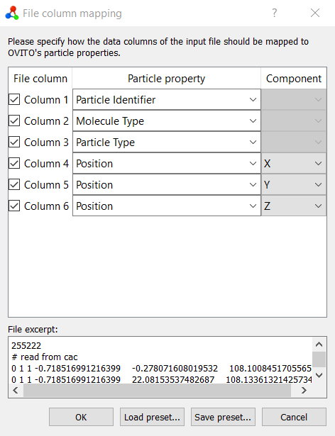

# CACmb Toolkit

This toolkit contains Python programs that allow for CAC data file pre/post processing outside the scope of the [core Fortran code](https://gitlab.com/aselimov/cacmb).

See `requirements.txt` for package dependencies. You can use pip to install these directly.

## convertor (_under development_)


The conversion type is inferred from file extension provided as input and output arguments

Currently supported conversions:

| From      | To        | Notes      |
| ------    | ------    | ------     |
| *.nodal   | *.cac     | readable by LAMMPS `read_data`     |
|           | *.last    | mixed-resolution NEB replica |
|           | *.cacovito| visualization of CAC nodes in OVITO     |
| *.dump    | *.last     | LAMMPS NEB replica format     |
| *.cac     | *.cacovito| 

### Installation and usage
From this directory...
```
pip install .
```

**Examples**

Command line args are self explanatory
`--replace [-r]` is overwrite without prompting

```
python -m convertor -h
python -m convertor -i INPUTFILE -o OUTPUTFILE
python -m convertor -i input.nodal -o output.cac -r
```

### \*.cacovito format
This format allows you to view CAC structure files in OVITO and color by property. Molecule Type = 1 for nodes, = 0 for atomic DOF.
Load the custom column mapping as:



